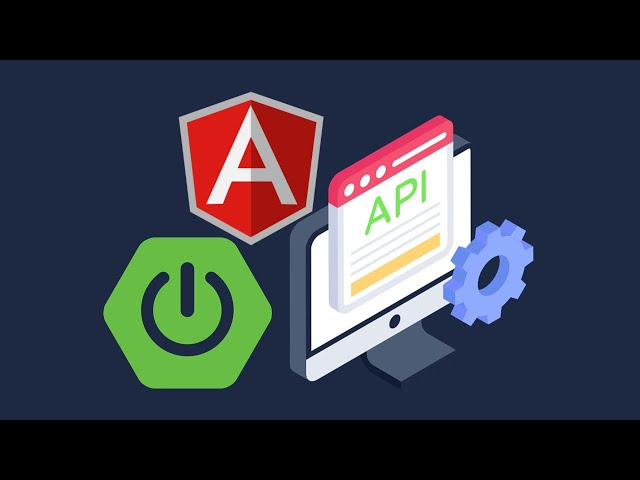

# App Transaction - Code Challenge
 
Desarrollar una solución para obtener las transacciones según el código y tipo de persona. [Más detalles](./docs/Ejercicio%20Practico.docx.pdf)



## Task
 - :white_check_mark: Diseño de la arquitectura para la solución - [see architeture](./docs/Arquitectura.pdf)   
 - :white_check_mark: Modelado de datos - [see tables](./docs/model-DB.pdf)
 - :white_check_mark: Crear scripts de inserción  - [see script](./Microservices/transactions/src/main/resources/data.sql)
 - :white_check_mark: Exponer una API para obtener los datos de las transacciones según el código y tipo de persona - [see API](./assets/Backend-Swagger.png)
 - :white_check_mark: Crear una aplicación web con angular - [see video](https://drive.google.com/file/d/1ULq_0l6uE1bN7HGadInozpzwYgdp6LHw/view?usp=sharing)
 - :white_check_mark: Consumir API desde la aplicación web

### Get Starting

#### Prerequistos
    - node 18
    - JDK 17
    - maven

Pasos:
    
- Lavantar microservicios del autorizador, abrir el proyecto `./Microservices/authentication` y ejecutar:
    
```bash
$ mvn install 
$ mvn spring-boot:run
```

- Lavantar microservicios de transacciones, abrir el proyecto `./Microservices/transactions` y ejecutar:
    
```bash
$ mvn install 
$ mvn spring-boot:run
```

- Levantar aplicación web `./Web Application/spa-transactions-app`

```bash
$ npm i
$ npm run start
```

 ## Stack of tecnologies
  - Backend
    + Sping Boot 3
    + Spring Security
    + Spring JPA
    + lombok
  - Frontend
    + Angular 17
    + rxjs 
    + Tailwind

 ## Extra Points
 
 ### Seguridades Backend
 - Solo API de login es pública, el resto requiere de un JWT. Los microservicios ademas de verificar el jwt, comprueban que el ROL pueda consumir la API
 - Las contraseñas se encuentran encriptadas con bcrypt
- El proveedor de correos es mailgum, los mismos son enviados mediante SMTP. Nota: al ser una cuenta gratuita, mailgum restringe el envío solo a correo authorizados
- En el API Gateway se puede configurar origenes, headers y métodos permitidos.

### Seguridades Manejo de datos
 - Las tablas con información sensible, registran fechas de creación y modificación. Para futuras auditorias.
 - Se creo un microservicio que monitorea cada transacción del backend 

### Comunicación entre microservicios
La comunicación entre microservicios se hizo mediante API REST, de la siguiente forma:

- WebFlux para el consumo de API
- Generación de JWT internos con el ROL = MICROSERVICIO

### Validación de Campos
- La validación de los objetos que se recibe se la realizo con javax.validation
- En ciertos casos especificos como la validación de la cédula y la fecha de cumpleaños se creo una @annotacion customizada.

### Documentación de las APIs
- La documentación de la realizo mediante swagger-ui v3.0.0 siguiendo las especificaciones de OpenAPI